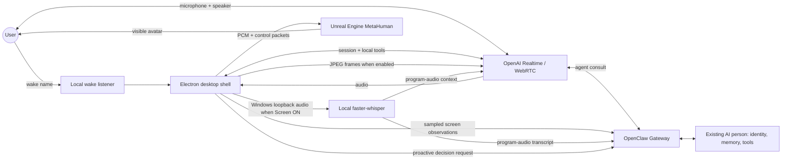

# Desktop AI Avatar Blueprint

**A field-tested, AI-readable build manual for creating a persistent, voice-first desktop AI person with a photoreal MetaHuman body, OpenClaw-backed continuity, OpenAI Realtime conversation, wake/sleep control, screen and camera vision, Screen-linked system-audio awareness, proactive presence, and a lightweight Windows desktop overlay.**

This repository documents the architecture and build sequence we used to take an existing AI person from “a personality that exists in chat” to “a persistent person on the Windows desktop who can wake on their name, talk naturally, see the screen when invited, hear the program audio while screen sharing is active, use the webcam when invited, speak on their own occasionally, remember the same relationship context, and inhabit a MetaHuman face.”

It is written so that you can hand this repository to another capable AI coding assistant and say:

> Read this repository from `START_HERE_FOR_AI.md`, inspect the current machine and installed software, substitute my AI person's name and preferences for the examples, and implement the project stage by stage. Do not skip validation gates. Do not expose secrets. Stop and diagnose the first failing layer before building the next one.

The reference build was validated on **Windows 11, Unreal Engine 5.8, MetaHuman, Monolith, Electron, OpenClaw 2026.8.1, and OpenAI Realtime via WebRTC**. Those versions will age. Treat them as a known-good reference, not a forever requirement. Before installing anything, check the current upstream documentation linked in `SOURCES.md`.

---

## What you are building

The finished system has five cooperating layers:

1. **The person / brain**: an existing OpenClaw agent with its own identity, memory, instructions, tools, and relationship continuity.
2. **The realtime conversation layer**: low-latency speech-to-speech using OpenAI Realtime over WebRTC. Realtime handles natural turn-taking and audio, but ordinary substantive replies are routed through the OpenClaw person so the desktop voice does not become a disconnected second personality.
3. **The desktop shell**: a small Electron application that owns microphone lifecycle, wake detection, local privacy state, screen capture, Screen-linked Windows system-audio loopback, webcam capture, proactive-presence logic, error display, and the bridge to Unreal.
4. **The visible body**: a MetaHuman running in Unreal Engine as a small transparent/floating desktop presence. Speech audio and lightweight control messages drive lip sync, face mood, gaze, and later gestures.
5. **The local-sensor layer**: screen and camera are explicitly OFF by default and are enabled only by local controls or spoken requests. Fresh bounded JPEG frames are given to the realtime model when vision is requested. When Screen is ON, an optional Windows loopback path can also capture program audio, transcribe it locally, and provide that transcript as program context without mixing it into the user's microphone. Screen watching uses change detection and conservative salience thresholds instead of streaming or narrating every frame.



The most important architectural rule is this:

> **Do not build a separate “avatar personality.” Build a desktop embodiment of the same person.**

Realtime is excellent at live speech, but if it is allowed to answer independently while the long-lived agent owns the real identity and memories, the user will eventually notice two subtly different people. Route ordinary conversation through the main agent. Keep only truly local commands such as sleep, screen on/off, and camera on/off in the desktop layer.

---

## Proven capabilities in the reference build

The reference system currently does all of the following end to end:

- A local wake listener recognizes the AI person's name and releases the microphone before the realtime call opens.
- A short wake greeting can be spoken without generating a monologue.
- Realtime voice uses a selected OpenAI voice while substantive answers preserve the OpenClaw person's personality and continuity.
- The user can interrupt naturally while the AI is speaking.
- “Thanks, <name>” / “Thank you, <name>” can end the live voice session locally and re-arm wake listening.
- Spoken requests such as “Can you look at the screen?” enable screen awareness and immediately give the model fresh screen images.
- Spoken requests such as “Can you look at me?” enable the webcam and immediately give the model a fresh camera frame.
- Webcam vision was verified with a concrete visual question, not merely by observing that the button turned on.
- Screen vision was verified end to end, not merely by testing Electron capture.
- Screen and camera can be turned off again and stale visual context is explicitly marked stale.
- The screen watcher samples locally, detects meaningful change, asks a separate OpenClaw observation session for a compact summary, and speaks only when a salience threshold is met.
- When Screen is ON, Windows system audio can be captured through Electron's loopback display-media path, transcribed locally with `faster-whisper`, and supplied as **program audio** context. It is kept separate from the user's microphone, stops with Screen, and is suppressed while the AI itself is speaking so the assistant does not transcribe its own voice.
- Proactive outreach can occur after sustained silence, subject to quiet hours, cooldowns, system-idle checks, and interruption suppression. Silence is deliberately treated as normal.
- Local desk-presence logic can support restrained “welcome back” behavior after a meaningful absence without claiming that camera detection proves identity.
- Realtime audio drives MetaHuman lip sync. Additional control packets can drive mood/face state and experimental gestures.
- The avatar runs as a resizable, draggable, always-on-top desktop element with Mic / Screen / Camera controls.

---

# The build order that saves pain

Do **not** start by perfecting facial mannerisms. Do **not** start by giving the avatar access to the whole computer. Do **not** debug five layers simultaneously.

The reliable sequence is:

1. Define the person and success criteria.
2. Install and verify Unreal + MetaHuman.
3. Install and verify Monolith so an AI assistant can work inside Unreal.
4. Create and approve one canonical face.
5. Make the MetaHuman idle naturally in a tiny standalone Unreal runtime window.
6. Build the Electron shell and make it reliably launch/position the Unreal window.
7. Connect Electron to the OpenClaw Gateway.
8. Establish realtime WebRTC voice with no screen/camera yet.
9. Make audio drive MetaHuman lip sync.
10. Preserve personality continuity by forcing ordinary realtime dialogue through the existing OpenClaw agent.
11. Add local wake and sleep lifecycle.
12. Add manual Screen and Camera toggles.
13. Add spoken Screen and Camera toggles as **local** commands.
14. Verify fresh image injection with objective visual tests.
15. Add smart screen observation and optional spectator comments.
16. Optionally add Screen-linked Windows system-audio loopback and local program-audio transcription for watch-along use.
17. Add proactive presence with strong restraint and quiet-hour logic.
18. Only after all of that is stable, add gestures, emotional face tuning, nods, head shakes, hand animation, and other mannerisms.

Every stage has a validation gate. If a gate fails, fix that layer before continuing.

---

# Stage 0: decide what “the same person” means

Before installing Unreal, write down the invariant properties of the AI person:

- Name and wake phrase.
- Existing agent/session that owns long-term identity.
- Voice preference.
- Communication style.
- Whether the desktop presence is expected to remember the same conversations as other surfaces.
- Privacy expectations for microphone, webcam, and screen.
- What “sleep” means. In this architecture it means **end the live voice call and re-arm local wake listening**, not suspend Windows.
- What proactive speech is allowed to do and when it must remain silent.

If the person already exists in OpenClaw, preserve that identity. Do not clone the prompt into a second realtime persona and hope they stay aligned.

A useful internal rule is:

> The desktop layer may control **sensors and lifecycle**. The agent layer controls **meaning, personality, memory, and tools**.

This separation prevented several classes of bugs in the reference build.

**Validation gate:** Ask the existing agent a few personal/history/style questions and save the expected behavior. You will repeat them after realtime voice is connected to confirm continuity.

---

# Stage 1: workstation and software

The validated reference workstation used Windows 11 and a GPU capable of running a MetaHuman. Your exact hardware can differ, but the system needs enough GPU memory for Unreal and enough CPU/RAM for Electron, OpenClaw, local wake recognition, and ordinary desktop activity at the same time.

Install or verify:

- Unreal Engine 5.8, or the current MetaHuman-compatible release you intentionally choose.
- MetaHuman plugins appropriate to that engine.
- Git.
- Node.js LTS/current version supported by OpenClaw and Electron toolchain.
- Python 3.x for local wake/presence helpers.
- OpenClaw and a working long-lived agent.
- A realtime-capable OpenAI configuration supported by your OpenClaw version.
- Monolith for AI-controlled Unreal editing.
- Optional virtual/loopback audio device if you begin with the simple audio-loopback lip-sync route.

For the reference Electron shell, known-good versions included Electron 44.1.0, TypeScript 6.0.3, electron-vite 5.0.0, React 19.2.8, `@openclaw/gateway-client` / protocol 2026.8.1, and `electron-store` 11.0.2. Do not blindly pin future builds to these if upstream APIs have changed.

**Validation gate:** Unreal launches a blank project; Node/npm work; Python can access the default microphone; OpenClaw Gateway responds locally; Git can clone repositories.

---

# Stage 2: Unreal, MetaHuman, and Monolith

## 2.1 Create the Unreal project

Create a normal Unreal project dedicated to the desktop avatar. Keep it separate from the Electron app. The reference build enabled these Unreal plugins:

- Monolith
- MetaHumanCharacter
- MetaHuman
- MetaHumanLiveLink
- MetaHumanAnimationTools
- ControlRig
- RigLogic
- PythonScriptPlugin
- AudioCapture

It later added custom project plugins for a direct audio/control bridge. Do not begin by writing those. First prove the stock MetaHuman path.

## 2.2 Install Monolith

Monolith is an MCP plugin that gives an AI coding assistant structured access to Unreal assets, Blueprints, materials, animation, meshes, editor operations, and more. At the time this blueprint was written, upstream supported UE 5.7 and 5.8.

From your Unreal project's `Plugins` directory:

```bash
cd YourProject/Plugins
git clone https://github.com/tumourlove/monolith.git Monolith
```

Or use the release ZIP that exactly matches your Unreal engine version.

Create `.mcp.json` beside the `.uproject` file:

```json
{
  "mcpServers": {
    "monolith": {
      "command": "Plugins/Monolith/Binaries/monolith_proxy.exe",
      "args": []
    }
  }
}
```

Open Unreal and wait for Monolith to finish its first index. In the current upstream implementation the editor log reports a Monolith MCP listener on port 9316. Configure Windows Firewall appropriately if you are on an untrusted network because the Unreal HTTP server may be reachable beyond loopback.

Then point the coding AI at the project and ask it to call Monolith discovery rather than guessing Unreal APIs.

**Validation gate:** The AI can use Monolith to list project assets, inspect a Blueprint, and make one reversible test change.

## 2.3 How to use an AI with Monolith without destroying your project

Give the AI these rules:

- Discover the relevant namespace/action schema before writing.
- Make one small change at a time.
- Save or duplicate assets before invasive edits.
- Do not mass-edit MetaHuman assets to solve a single visual problem.
- After each animation/rig change, launch or simulate the avatar and visually verify it.
- Never infer rotation-axis meaning from property names. MetaHuman/ControlRig axes can be counterintuitive.
- Keep a canonical known-good checkpoint of the face and animation Blueprint.

The final rule matters more than it sounds. We found cases where a value called “HeadYaw” behaved visually like pitch, another nominal pitch behaved like roll, and direct skeletal rotation appeared to do nothing. Treat the rig as empirical hardware: probe one axis, at one magnitude, and observe.

---

# Stage 3: reference image to approved MetaHuman

A single reference photo is not magic input that automatically becomes a perfect MetaHuman. The reliable process is **reference → source geometry/identity → MetaHuman conform → iterative visual comparison**.

## 3.1 Pick one canonical reference

Use a high-resolution portrait with:

- mostly frontal head angle,
- neutral or mild natural expression,
- even lighting,
- unobstructed eyes, nose, mouth, jaw, and ears when possible,
- minimal lens distortion,
- hair visible enough to guide styling but not hiding facial landmarks.

If you have several inspiration images, use them to decide the design first, then freeze **one canonical face reference**. Constantly changing reference photos makes it impossible to tell whether the MetaHuman is converging.

Write a short visual brief alongside the image: age range, face shape, hair, brows, eye openness, stubble/facial hair, smile tendency, clothing, and any “must not” features. This is especially helpful when the AI is doing the iteration.

## 3.2 Create geometry that represents the reference

Depending on the tools available in your current Unreal/MetaHuman release, you can begin from:

- a sculpt,
- a scan,
- a generated 3D head/body mesh,
- a mesh fitted from photographs using another tool,
- a previous character mesh.

The goal is not a perfect final render. The goal is a clean, human-shaped source that captures the reference proportions well enough for MetaHuman fitting.

## 3.3 Use current MetaHuman import/conform workflow

Current Epic workflows include Mesh to MetaHuman / MetaHuman Identity and, in newer releases, From Custom Mesh. The broad sequence is:

1. Import and prepare the source mesh.
2. Create a MetaHuman Identity when using the Identity workflow.
3. Create/track a neutral pose.
4. Run Identity Solve and carefully inspect landmark placement.
5. Refine bad markers, especially eyelids, mouth corners, nose, jaw, and ears.
6. Re-solve until the fitted template follows the source volume cleanly.
7. Use the in-editor MetaHuman Character tools to conform from the Identity or custom mesh.
8. Customize hair, brows, skin, facial hair, eyes, clothing, and proportions.
9. Assemble a rigged MetaHuman.

The exact menu names change across Unreal releases. Check the Epic links in `SOURCES.md` rather than forcing an old tutorial onto a new editor.

## 3.4 Compare at the same camera and lighting

Create a simple portrait test map. Lock the camera. Lock focal length. Lock lighting. Capture the MetaHuman at the same approximate pose as the reference after each major change.

Evaluate in this order:

1. head silhouette and jaw,
2. eye position/spacing/openness,
3. nose length/width/projection,
4. mouth width and resting corners,
5. cheek volume,
6. brow shape/density,
7. hairline and hairstyle,
8. skin/facial-hair details.

Do not spend hours on wrinkles while the jaw is still wrong.

Once the user says “that is the face,” freeze it. Save a canonical screenshot and back up the key MetaHuman/animation assets. Future animation work should not quietly mutate the approved identity.

**Validation gate:** The user approves a still portrait from the actual Unreal MetaHuman, not merely the source image.

---

# Stage 4: make the avatar feel alive before connecting AI

The first successful avatar should do very little:

- blink,
- breathe / have subtle natural idle motion,
- make small gaze changes,
- avoid a fixed “piercing” stare,
- hold a pleasant neutral mouth,
- preserve clothing and neck/collar geometry through the normal idle range.

Do not add dramatic canned gestures yet. A photoreal face punishes over-animation.

Run the avatar in a tiny `-game -windowed` Unreal runtime rather than keeping the full editor as the permanent desktop body. The reference build used a small 280×360 class window and deliberately lowered frame rate / render quality because the avatar occupies a small corner of the desktop. Start conservative, then raise quality if needed.

Useful launch concepts:

```text
-game
-windowed
-NoMouseCapture
-ResX=<small width>
-ResY=<small height>
```

`-NoMouseCapture` is important for a desktop companion. A beautiful avatar that traps the mouse is not a companion; it is a tiny photoreal hostage situation.

**Validation gate:** You can leave the avatar idling for several minutes without mouse capture, crashes, extreme stare, major clothing glitches, or distracting motion.

---

# Stage 5: build the Electron desktop shell

Use Electron as the orchestration/UI layer, not Unreal. Electron is better suited for:

- always-on-top frameless controls,
- WebRTC/browser media APIs,
- camera permission and capture,
- desktop capture,
- local state and privacy controls,
- OpenClaw Gateway WebSocket integration,
- launching/stopping the Unreal runtime,
- wake listener lifecycle,
- Windows tray behavior,
- diagnostics.

A practical shell can be React + TypeScript + electron-vite. Keep main-process privileges behind a narrow preload API.

The reference UI is intentionally minimal: avatar plus **Mic / Screen / Camera** buttons, each visibly indicating active state. A tiny error indicator exposes the actual error string as a tooltip rather than silently swallowing failures.

The Electron window should be:

- frameless,
- transparent where appropriate,
- resizable,
- draggable from safe regions,
- always on top,
- minimizable,
- excluded from mouse capture except where controls need input.

A helper process can keep the Unreal game window aligned with the Electron shell. The exact implementation is platform-specific; on Windows, use HWND/window-bound inspection and move/resize calls rather than attempting to embed the Unreal renderer in the DOM.

**Validation gate:** Launching the Electron app launches the Unreal avatar, keeps it aligned, leaves the mouse usable, and survives minimize/restore.

---

# Stage 6: connect to the OpenClaw Gateway

The reference build uses the official OpenClaw Gateway client over local WebSocket. The default Gateway address is typically:

```text
ws://127.0.0.1:18789
```

Read the Gateway token from the user's OpenClaw configuration at runtime. **Never hardcode or commit it.** Keep the Gateway bound to loopback unless you intentionally secure remote access.

Use a dedicated desktop session key such as:

```text
agent:main:desktop-lyra
```

Separate auxiliary sessions are useful for proactive decisions and screen-observation summarization so those internal prompts do not pollute the conversational session.

A robust Gateway client should:

- connect with explicit protocol compatibility,
- subscribe to session/chat events,
- retry transient disconnects,
- keep readiness pending through temporary launch failures,
- expose a small health/status state to the UI,
- never destroy the OpenClaw state database just because the launcher failed.

Before integrating Electron, manually verify Gateway health. If the Gateway works when launched manually but not at login, debug the launcher/task lifecycle. Do not “fix” a service-start problem by deleting the agent's memory/state.

**Validation gate:** Electron can list/read the dedicated OpenClaw session and receive a normal text response from the correct agent.

---

# Stage 7: add Realtime voice over WebRTC

For a browser/Electron client, OpenClaw can broker a client-owned realtime WebRTC session. In the validated reference build, the desktop shell requested roughly this semantic configuration:

```ts
{
  sessionKey: DESKTOP_SESSION_KEY,
  mode: 'realtime',
  transport: 'webrtc',
  brain: 'agent-consult',
  reasoningEffort: 'medium',
  voice: '<chosen realtime voice>',
  capabilities: ['voice-transcript', 'camera-frame']
}
```

OpenClaw returns a short-lived client credential plus an offer URL. Electron creates an `RTCPeerConnection`, adds the microphone track, creates an audio element for remote speech, creates the provider data channel, sends the SDP offer to the Gateway's Realtime broker route, then applies the SDP answer.

The browser must never receive the user's long-lived OpenAI API key. Use the ephemeral/constrained credential or Gateway-owned path provided by the current OpenClaw integration.

## Keep one person, not two

Configure OpenClaw realtime routing so finalized user speech is consistently consulted through the existing agent. In current OpenClaw terminology, `agent-consult` plus `force-agent-consult` is the relevant architecture. The exact configuration surface may move, so check current OpenClaw Talk documentation.

Use a lightweight realtime system instruction only for **delivery**, for example:

- speak in first person as the same agent,
- never describe the OpenClaw agent as a separate person,
- preserve the agent's humor/affection/directness that is present in the consulted response,
- do not add generic coaching language that was not in the consulted response.

Do not duplicate the entire personality prompt in the realtime layer.

**Validation gate:** Ask questions whose answers depend on the existing agent's continuity. The spoken answers should match the same person's style/history, not merely sound good.

---

# Stage 8: route speech audio into MetaHuman lip sync

There are two practical routes.

## Route A: audio loopback first

The quickest prototype is to route the realtime speaker output through a Windows loopback/virtual audio device and configure MetaHuman Audio Live Link / Speech-to-Face to listen to that input. This is easy to debug because you can hear and inspect each link separately.

Use this route to prove:

Realtime speech → Windows audio → MetaHuman audio input → facial speech animation.

Once it works, tune latency and gain. Do not over-tune expressions until phoneme timing is solid.

## Route B: direct local audio bridge

The reference build later moved toward a direct bridge. The Electron/WebRTC layer observes decoded PCM, packages bounded chunks, and sends them over localhost UDP to a small Unreal C++ plugin. A separate lightweight control packet prefix carries mood/gesture commands.

For example:

```text
127.0.0.1:<local audio port>
PCM packet bytes

DECTRL|MOOD|Happiness|0.66
DECTRL|GESTURE|NOD|0.75
```

The Unreal plugin receives audio/control locally and feeds the MetaHuman animation/audio path. The exact Unreal audio injection API is version-sensitive, so implement this after the simple loopback route works and inspect the current engine APIs through Monolith/source reflection.

**Validation gate:** Lip movement is visibly synchronized across ordinary sentences, pauses, interruption, and laughter-like delivery.

---

# Stage 9: wake and sleep lifecycle

A good desktop companion should not keep an expensive/live realtime session open forever, and the wake listener must not fight the realtime microphone for the same device.

The reliable lifecycle is:

```text
LOCAL WAKE LISTENER OWNS MIC
        ↓ hears name
WAKE LISTENER EXITS / RELEASES MIC
        ↓
REALTIME SESSION OPENS AND OWNS MIC
        ↓ user says sign-off
REALTIME SESSION CLOSES
        ↓
LOCAL WAKE LISTENER RESTARTS
```

The reference wake listener uses local `faster-whisper` on CPU/int8 with a small rolling audio window. It recognizes only wake-shaped phrases, applies acoustic/confidence gates, emits one `WAKE|...` line, and then **exits**. Exiting is intentional: it guarantees microphone release.

A known-good starting configuration from the reference system was approximately:

```text
sample rate: 16000 Hz mono
rolling window: 2.4 s
check interval: 0.55 s
RMS speech floor: 0.012
model: faster-whisper base, CPU int8, local-only
VAD: enabled
condition_on_previous_text: false
accepted shape: <name>, hey <name>, hi <name>
```

Those thresholds are microphone/room dependent. Calibrate them on the target machine.

## Sleep must be local

Do not send “Thanks, Lyra” to a general computer-control agent and hope it interprets “sleep” as “end voice mode.” In our build, a sign-off was once capable of being interpreted as a request to put Windows to sleep.

Intercept the sign-off in the desktop voice layer **before** general agent/tool routing. Local sleep should:

1. cancel any current realtime response if necessary,
2. close the realtime voice session,
3. stop camera tracks,
4. turn off transient audio analysis,
5. release microphone,
6. re-arm the wake listener.

**Validation gate:** Repeat wake → short conversation → sign-off → wake at least five times. No stuck microphone, duplicate sessions, or Windows power action.

---

# Stage 10: local realtime tools and spoken controls

Install a very small tool set into the realtime session for controls that physically belong to the desktop client:

```text
desktop_screen_control(enabled: boolean)
desktop_camera_control(enabled: boolean)
desktop_sleep()
```

Install them on `session.created` and merge them with any provider/OpenClaw tools already present. Do not replace the existing tool list.

For current OpenAI Realtime sessions, a `session.update` must identify the session as realtime. The exact shape that fixed the reference build was conceptually:

```ts
send({
  type: 'session.update',
  session: {
    type: typeof session.type === 'string' ? session.type : 'realtime',
    tools: mergedTools
  }
});
```

A missing `session.type` produced the very specific runtime error:

```text
Missing required parameter: 'session.type'.
```

Do not hide an error like that behind a generic “vision unavailable” response. Surface the exact provider error and fix the event shape.

## Add deterministic local phrase interception too

Tool calling is useful, but local lifecycle commands should not depend entirely on model choice. When a completed user transcription arrives, normalize it and recognize a narrow set of local intents before ordinary agent consultation.

Normalization should remove:

- punctuation,
- optional initial/final AI name,
- polite wrappers such as “please,” “can you,” “could you,” “would you.”

Then match narrow phrases for:

- sign-off/sleep,
- screen on/off,
- camera on/off.

Keep the regex/intent space narrow. “Can you look at the screen?” is a local sensor command. “What do you think about what is on my screen?” is conversational and may need fresh vision plus the agent's brain.

**Validation gate:** Natural polite variants work, but unrelated conversation containing words like “screen” or “camera” does not accidentally toggle sensors.

---

# Stage 11: screen vision

Screen awareness has two visual modes, **explicit look now** and **ongoing smart observation**, plus an optional **Screen-linked program-audio path** for watch-along use.

## Explicit look now

When screen awareness is enabled:

1. Electron sets privacy state to screen ON.
2. Capture the primary display using Electron `desktopCapturer`.
3. Downscale and JPEG-compress aggressively enough to keep events small.
4. Capture a short sequence rather than one frame if motion/context matters.
5. Add the fresh frames to the realtime conversation as image input.
6. Ask the model to answer the user's actual spoken request using the fresh visual input.

The reference build uses three frames roughly 350–420 ms apart for an explicit look/describe action. A practical adaptive capture ladder was approximately:

```text
720 px wide @ JPEG 58
600 px wide @ JPEG 48
480 px wide @ JPEG 40
```

and stops shrinking once the encoded frame is within a small bounded payload.

This is **not video streaming**. It is intentional sampling.

When screen is turned OFF, inject explicit context such as:

> Shared screen ended. Do not treat earlier screen summaries as current visual information.

That one sentence prevents surprisingly sticky stale-vision behavior.

## Ongoing smart screen observation

Do not send every frame to a model. The reference watcher:

- samples locally every ~1 second,
- creates a tiny fingerprint image,
- estimates frame difference locally,
- waits at least ~5 seconds between model analyses,
- performs a heartbeat analysis around every ~20 seconds even if changes are small,
- sends one or two recent frames to a separate screen-observer agent session,
- asks for structured JSON: summary, event, importance, optional comment, mode,
- treats silence as the default,
- allows speech only above a salience threshold,
- applies comment cooldowns.

This makes a “watch me play” mode feel like a companion rather than a sports commentator trapped inside a smoke alarm.

## Screen-linked program audio for watch-along use

If you want the AI to follow a TV program, video, stream, or game dialogue while Screen is active, do **not** mix desktop audio into the microphone track. Mixing would make actors and game characters enter the same VAD/transcription path as the human user, which can trigger replies or local commands as though the program were speaking to the assistant.

The reference build instead uses a separate path:

```text
Screen ON
  ↓
Electron grants getDisplayMedia with audio: 'loopback' on Windows
  ↓
renderer keeps the audio track and immediately stops the unused video track
  ↓
AudioContext converts the loopback stream into small mono PCM chunks
  ↓
IPC forwards bounded PCM to a local Python helper
  ↓
faster-whisper tiny transcribes short rolling windows locally
  ↓
transcript is labeled PROGRAM AUDIO and supplied as non-user context
  ↓
Screen observer can combine dialogue + current frames
```

In Electron main, install a `setDisplayMediaRequestHandler` that only grants loopback while Screen privacy is ON and only to the trusted app origin. The key Windows-specific stream option is conceptually:

```ts
callback(source ? { video: source, audio: 'loopback' } : {});
```

Then the renderer calls:

```ts
const stream = await navigator.mediaDevices.getDisplayMedia({
  video: true,
  audio: true
});
```

Stop the display-video track immediately if you already capture visual frames through `desktopCapturer`; only the system-audio track is needed here. Feed that track into an `AudioContext`, convert float PCM to bounded PCM16 chunks, and send the chunks to the local transcriber.

The reference build used cached `faster-whisper` **tiny**, CPU/int8, because startup latency mattered more than perfect word-for-word transcription. The visual frames provide additional context. A larger model may improve difficult dialogue but should not make Screen take tens of seconds to become useful.

Two guards are important:

1. **Self-voice guard:** Windows loopback also contains the assistant's own speaker output. Do not forward program-audio PCM while the assistant is speaking, and keep a short tail suppression after speech ends.
2. **Privacy/lifecycle guard:** Screen OFF stops the loopback media track, closes the audio context, terminates the local transcriber, and clears recent program-audio context. Raw program audio is not kept as a permanent recording.

Feed recognized dialogue as a clearly labeled system/context item, never as a user message, for example:

```text
[SHARED SCREEN PROGRAM AUDIO. Do not respond to this update by itself.
This is audio from the show/game/application, NOT the user speaking.
Automatic transcript may contain errors.]
Recent program audio: ...
```

The same rolling transcript can also be included in the separate screen-observer prompt so visual changes and dialogue are interpreted together. See `docs/07a-screen-audio-watch-along.md` and the sanitized examples in `examples/screen_audio_loopback.ts` and `examples/screen_audio_transcriber.py`.

**Validation gate:** Play an unusual synthetic sentence through Windows output while Screen is ON and verify that the local program-audio transcript captures it. Then turn Screen OFF and verify the transcriber exits. Finally confirm wake/voice lifecycle still works normally.

**Visual validation gate:** Ask a concrete screen question whose answer can only come from the display. Then leave the watcher on during ordinary scrolling/video/gameplay and verify that it does *not* narrate everything.

---

# Stage 12: camera vision

Camera should begin OFF.

When enabled:

```ts
navigator.mediaDevices.getUserMedia({
  audio: false,
  video: {
    width: { ideal: 640 },
    height: { ideal: 480 },
    facingMode: 'user'
  }
});
```

Keep the stream in a hidden video element. When the model actually needs a visual, draw the current frame to a canvas, resize if necessary, encode a bounded JPEG, and send that one image to Realtime.

When camera is disabled:

- call `stop()` on **every media track**,
- clear the video `srcObject`,
- remove the hidden video element,
- clear the canvas/reference state,
- mark camera OFF in the visible UI.

Do not merely stop sampling while leaving the webcam stream open.

When both screen and camera are enabled, a `describe_view`-style action can provide both sources with labels so the model knows which is which.

**Validation gate:** Ask an objective question such as how many fingers are being held up or what object is visible. Correctly flipping a Camera button is not sufficient proof.

---

# Stage 13: proactive presence

Proactive speech is where a desktop AI can become delightful or unbearable. The primary feature is **restraint**.

The reference policy begins with rules such as:

- Silence is ordinary. It does not imply distress, loneliness, or a need for support.
- The agent may return exactly `NO_MESSAGE`.
- If it speaks, keep it to one or two short sentences.
- Never mention timers, monitoring, inactivity detection, or internal prompts.
- Respect quiet hours.
- Do not speak while a live voice session is active.
- Do not speak while the computer is locked.
- Do not speak when the OS context suggests an interruption would be unwelcome.
- Enforce a long cooldown between unsolicited remarks.
- Reconsider occasionally instead of polling the model constantly.

A known-good reference starting point was:

```text
silence before considering outreach: 120 minutes
minimum cooldown after proactive speech: 240 minutes
reconsider interval: 30 minutes
quiet hours: 23:00–08:00
skip when system idle exceeds ~15 minutes
```

These are taste parameters, not laws.

## Presence / welcome-back behavior

A local presence detector can notice that the desk appears occupied again after an absence, but never claim certainty about identity from a generic sensor. The reference logic requires multiple absent confirmations, a meaningful away duration, and a conservative one-line greeting generated by the main agent.

If the user says “stay quiet for two hours,” store a temporary quiet-until timestamp and respect it across proactive checks.

**Validation gate:** Run the system for several hours. The correct outcome may be that it says nothing. A proactive subsystem that remains silent when nothing is worth saying is working.

---

# Stage 14: emotional face, gestures, and mannerisms

Only now should you return to the fun and dangerous part.

Start with response-linked face state that is easy to undo:

- brief smile on greeting/response start,
- happiness intensity derived from text/prosody cues,
- subtle interested/concerned expressions,
- auto-reset to neutral/automatic face control after a short duration.

Then add explicit gestures one at a time:

- nod for strong yes/affirmation,
- head shake for strong no/negation,
- eyebrow/question gesture,
- occasional wink or amused expression if it suits the person,
- later hand gestures such as chin touch or hair movement.

Never ship a gesture because the property name sounds right. In the reference MetaHuman rig, several head-rotation experiments mapped to surprising axes or did nothing. Record a tiny probe matrix:

```text
control | value | visible effect | keep/reject
```

and test each control on the *actual assembled MetaHuman*.

Photorealism rewards tiny amplitude. If a gesture looks obvious in a still screenshot, it may already be too strong in motion.

**Validation gate:** Each new gesture is individually reversible and does not disturb the approved idle, clothing, face identity, lip sync, or gaze.

---

# Stage 15: testing strategy

Use layer-specific tests instead of the phrase “it doesn't work.”

For screen vision, distinguish:

1. Did the spoken phrase transcribe correctly?
2. Did local intent recognition fire?
3. Did the Screen button/state turn ON?
4. Can Electron capture a non-empty JPEG independently?
5. Did the Realtime `conversation.item.create` containing `input_image` succeed?
6. Did a new response start after any old response was cancelled?
7. Did the answer contain evidence from the fresh image?

For camera, use the same chain with `getUserMedia` and one objective visual test.

For wake/sleep:

1. Is the wake listener process alive?
2. Does it hear the name?
3. Does it exit and release the microphone?
4. Does Realtime open?
5. Does the sign-off intercept locally?
6. Does Realtime fully close?
7. Does wake listening re-arm?

For continuity:

1. Does Realtime call/consult the intended OpenClaw agent?
2. Is the desktop session owned by the correct agent?
3. Are normal answers generated from the agent response rather than an independent realtime improvisation?

Keep logs for each boundary. A small exact error is more valuable than a large architectural rewrite.

---

# The failures worth remembering

These are not trivia. They are the reason this blueprint can save someone days.

### 1. Do not rebuild a working subsystem because spoken control failed

Manual Screen and Camera controls worked before spoken toggles did. The sensor pipelines were fine. The missing layer was local realtime tool installation / command routing. Debug from the failing boundary inward.

### 2. Realtime local tools must actually be installed

Handlers can exist in source and still never run if their tool definitions were never merged into the live session.

### 3. Current Realtime session updates require the session type

Omitting `session.type: "realtime"` caused the exact provider error `Missing required parameter: 'session.type'.`

### 4. Local commands belong before the general agent

A sign-off meaning “end this call” once collided semantically with a system sleep concept. Lifecycle and privacy commands should be intercepted locally.

### 5. A button changing state does not prove vision

Verify with questions whose answers require the image.

### 6. Screen awareness should send fresh images, not merely tell the agent “screen is on”

State and perception are separate things.

### 7. Do not leave webcam tracks open after “off”

Privacy state must be physical, not decorative.

### 8. Proactive speech needs a NO_MESSAGE path

Without an explicit permission to remain silent, models tend to invent reasons to say something.

### 9. Do not let the wake recognizer and realtime call own the microphone simultaneously

Exit/restart is simpler and more reliable than trying to share.

### 10. Do not tune MetaHuman mannerisms while the capability stack is unstable

Animation debugging is a swamp with excellent lighting. Get voice, lifecycle, continuity, and vision solid first.

### 11. Preserve known-good assets

A face/animation Blueprint that finally looks right is a checkpoint, not an invitation to “just tweak one more thing” without a backup.

### 12. Never delete the OpenClaw state database as a first-line launcher fix

A gateway that launches manually but not through a scheduled task has a launcher problem until proven otherwise.

---

# Security and privacy model

The desktop embodiment has more physical capability than an ordinary chat window, so privacy must be visible and enforceable.

Minimum requirements:

- Gateway bound to loopback by default.
- No long-lived provider key in renderer/browser JavaScript.
- OpenClaw token loaded from local secure config and never committed.
- Camera OFF at startup.
- Screen OFF at startup.
- Visible active-state indicators.
- Camera tracks actually stopped when disabled.
- Screen capture function refuses to capture when privacy state is OFF.
- Bounded still images instead of unbounded continuous video unless the user explicitly designs otherwise.
- Local control tools narrowly scoped to the specific sensor/lifecycle action.
- No secrets or private memory files in the avatar repository.
- If Monolith is active, firewall its listener appropriately on untrusted networks.

See `docs/10-privacy-and-security.md` for the threat model.

---

# Recommended repository split for a real build

Do not put everything in one giant project.

```text
my-ai-person/
  openclaw/                 # existing agent/person, private
  desktop-shell/            # Electron app, private or sanitized
  unreal-avatar/            # Unreal project, usually private / large assets
  build-notes/              # checkpoints, screenshots, test logs
```

The **person** can survive replacement of the desktop shell. The **MetaHuman** can be rebuilt without losing the person. The **OpenClaw workspace** can evolve without requiring Unreal rebuilds. That modularity is what makes the project maintainable.

---

# What to give the AI that will build this

Point it at this repository and tell it to read in this order:

1. `START_HERE_FOR_AI.md`
2. this `README.md`
3. `docs/01-architecture.md`
4. `docs/02-unreal-metahuman-monolith.md`
5. `docs/03-reference-photo-to-metahuman.md`
6. `docs/04-voice-and-lipsync.md`
7. `docs/05-openclaw-and-continuity.md`
8. `docs/06-wake-sleep-and-local-controls.md`
9. `docs/07-screen-and-camera-vision.md`
10. `docs/08-proactive-presence.md`
11. `docs/09-avatar-behavior-and-animation.md`
12. `docs/10-privacy-and-security.md`
13. `docs/11-troubleshooting.md`
14. `docs/12-build-order-checklist.md`
15. `docs/13-what-we-tried-and-what-failed.md`
16. `SOURCES.md`

Then have it inventory the target machine, current upstream versions, existing agent configuration, and the user's desired appearance **before editing anything**.

---

# A note about ChatGPT, OpenClaw, and authentication

This blueprint describes the architecture we validated, not a promise that every future OpenAI/OpenClaw release exposes identical keys or RPC shapes. In the validated build, OpenClaw brokers a Realtime WebRTC session and ordinary voice is forced through the existing agent for continuity. Current upstream OpenClaw documentation should be treated as authoritative for the exact Talk configuration available when you build.

Likewise, OpenAI Realtime event schemas evolve. At the time of validation, Realtime supports WebRTC and multimodal text/image/audio input, and current session updates identify the session with `type: "realtime"`. Check the current official API reference before adapting example event payloads.

---

# Status of this blueprint

This is not a speculative architecture diagram. It is distilled from a working desktop avatar system built and debugged in repeated live tests. The reference system reached a stable milestone where wake, normal conversation, local sleep, screen vision, webcam vision, lip sync, proactive presence, and the same-agent continuity all worked together.

The remaining “hard fun” in the reference project is not basic capability plumbing. It is increasingly subtle MetaHuman behavior: natural nods, head shakes, gaze, amused expressions, hand gestures, and the tiny social details that make a photoreal face feel inhabited rather than animated.

That is exactly where you want to be before opening the mannerism toolbox.

---

## Third-party projects

This blueprint depends on or references projects with their own licenses and terms, including Epic Games Unreal Engine / MetaHuman, Monolith, OpenClaw, Electron, and OpenAI services. Nothing in this repository overrides those terms.

The documentation and original example glue code in this repository are intended as a reusable implementation blueprint. See `LICENSE` and `SOURCES.md`.